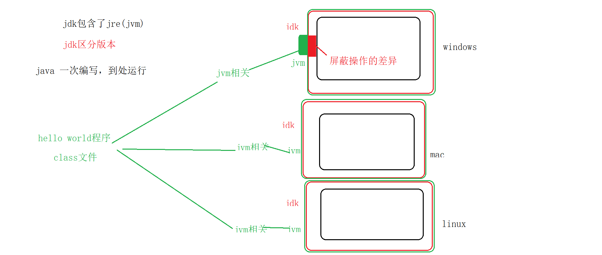
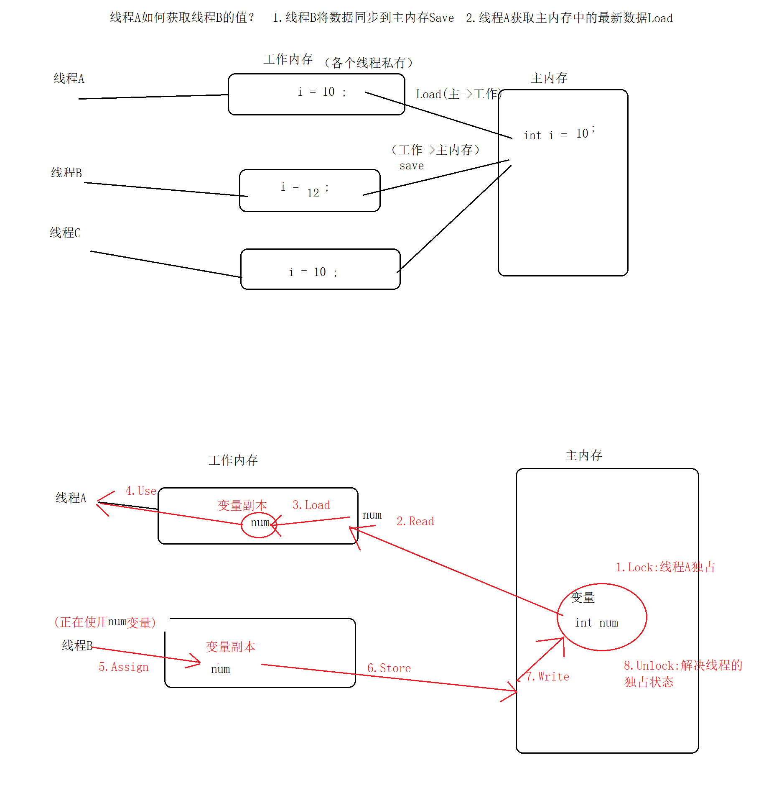
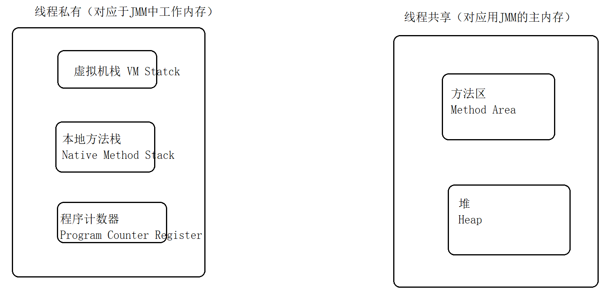
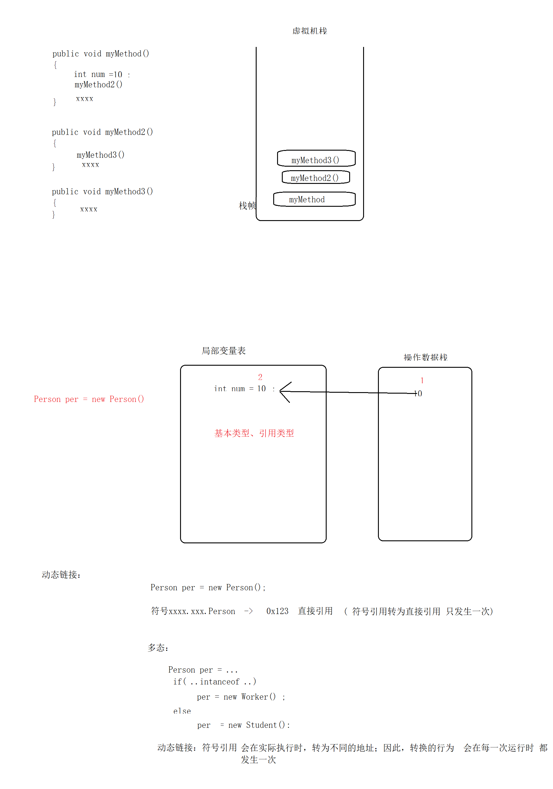
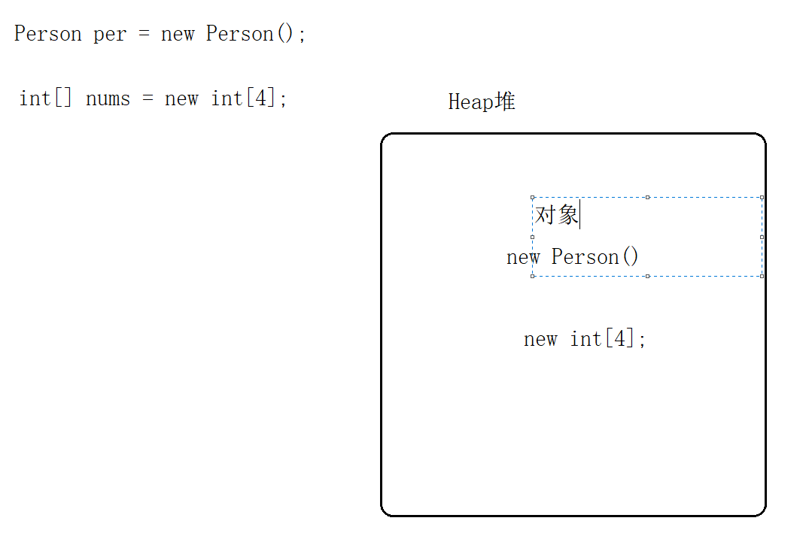
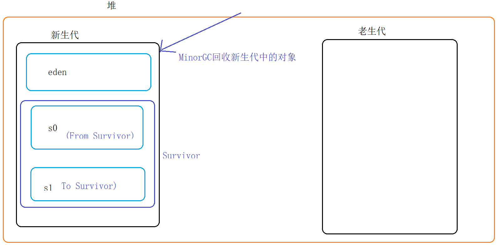
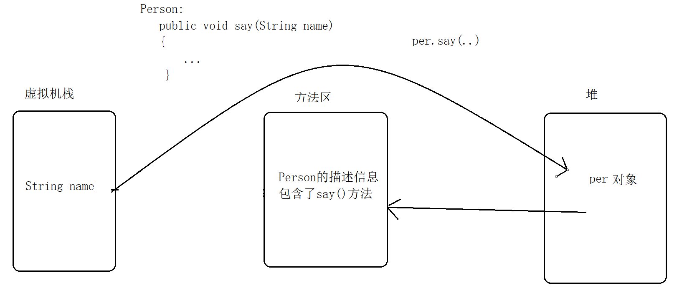
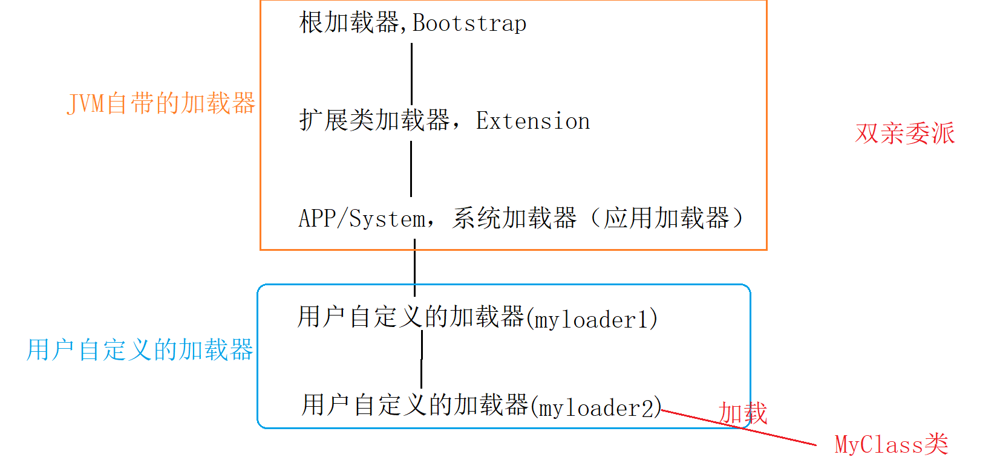
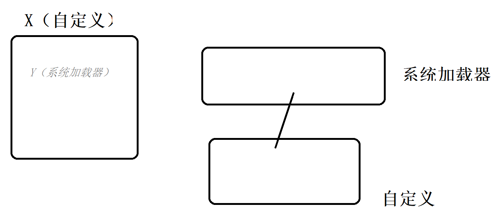
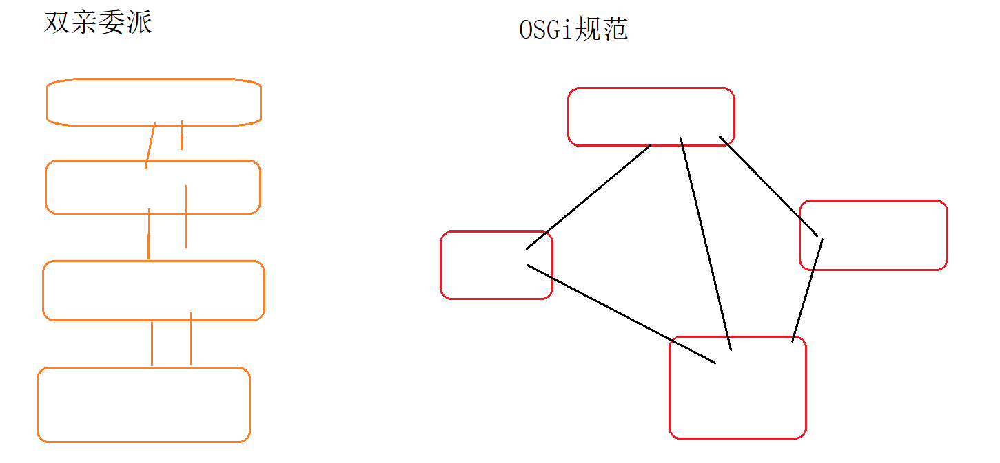

# JVM： java virtua Machine

jdk中包含了jvm和“屏蔽操作系统差异的组件”

- jvm各个操作系统之上是一致的
- “屏蔽操作系统差异的组件：在各个PC上各不相同（联想下载jdk，不同系统 需要下载不同版本的jdk）




## 类的生命周期

生命周期： 类的加载->连接->初始化->使用->卸载

-  类的加载

  查找并加载类的二进制数据（class文件）

  硬盘上的class文件 加载到jvm内存中

- 连接 ：确定类与类之间的关系  ； student.setAddress( address ); 

  - 验证

    .class 正确性校验

  - 准备

    static静态变量分配内存，并赋初始化默认值

    static int num =  10 ;  在准备阶段，会把num=0，之后（初始化阶段）再将0修改为10

    在准备阶段，JVM中只有类，没有对象。

    初始化顺序： static ->非static ->构造方法

    public class Student{

    ​	static int age ; //在准备阶段，将age = 0 ;

    ​	String name ; 

    }

    

  - 解析:把类中符号引用，转为直接引用

    前期阶段，还不知道类的具体内存地址，只能使用“com.yanqun.pojo.Student ”来替代Student类，“com.yanqun.pojo.Student ”就称为符号引用；

    在解析阶段，JVM就可以将 “com.yanqun.pojo.Student ”映射成实际的内存地址，会后就用 内存地址来代替Student，这种使用 内存地址来使用 类的方法 称为直接引用。

 - 初始化：给static变量 赋予正确的值

static int num =  10 ;  在连接的准备阶段，会把num=0，之后（初始化阶段）再将0修改为10

 - 使用： 对象的初始化、对象的垃圾回收、对象的销毁
 - 卸载


jvm结束生命周期的时机：

- 正常结束
- 异常结束/错误  
- System.exit()
- 操作系统异常


## JVM内存模型（Java Memoery Model，简称JMM）

JMM:用于定义（所有线程的共享变量， 不能是局部变量）变量的访问规则

JMM将内存划分为两个区： 主内存区、工作内存区

- 主内存区 ：真实存放变量
- 工作内存区：主内存中变量的副本，供各个线程所使用


注意：1.各个线程只能访问自己私有的工作内存（不能访问其他线程的工作内存，也不能访问主内存）

2.不同线程之间，可以通过主内存 简介的访问其他线程的工作内存


完整的研究：不同线程之间交互数据时 经历的步骤：

1.Lock:将主内存中的变量，表示为一条线程的独占状态

2.Read：将主内存中的变量，读取到工作内存中

3.Load：将2中读取的变量拷贝到变量副本中

4.Use：把工作内存中的变量副本，传递给线程去使用

5.Assign:把线程正在使用的变量，传递给工作内存中的变量副本中

6.Store:将工作内存中变量副本的值，传递到主内存中

7.Write：将变量副本作为一个主内存中的变量进行存储

8.Unlock:解决线程的独占状态



JVM要求以上的8个动作必须是原子性的;jvm但是对于64位的数据类型（long double）有些非原子性协议。说明什么问题：在执行以上8个操作时，可能会出现 只读取（写入等）了半个long/double数据，因此出现错误。如何避免？ 1.商用JVM已经充分考虑了此问题，无需我们操作  2.可以通过volatile避免此类问题（读取半个数据的问题）   volatile double num ;

## volatile 

概念：JVM提供的一个轻量级的同步机制

作用：

1.防止JVM对long/double等64位的非原子性协议进行的误操作（读取半个数据）

2.可以使变量对所有的线程立即可见（某一个线程如果修改了 工作内存中的变量副本，那么加上volatile 之后，该变量就会立刻同步到其他线程的工作内存中）

3.禁止指令的“重排序”优化


原子性 ： num = 10 ;

非原子性： int num = 10 ; -> int num ;   num =10 ;


重排序：排序的对象就是 原子性操作，目的是为了提高执行效率，优化

```java
int a  =10 ; //1    int a ; a = 10 ;
int b ;//2
b = 20 ;//3
int c = a * b ;//4
```

重排序“不会影响**单线程**的执行结果”，因此以上程序在经过重排序后，可能的执行结果：1,2,3,4 ；2,3,1,4

```java
//2 3 1 4
int b ;
b = 20 ;
int a  =10 ;
int c = a * b ;
```


```java
package com.yanqun;
//双重检查式的懒汉式单例模式
public class Singleton {
    private static Singleton instance = null ;//单例
    private Singleton(){}
    public static Singleton getInstance(){
        if(instance == null){
            synchronized (Singleton.class){
                if(instance == null){
                    instance = new Singleton() ;//不是一个原子性操作
                }
            }
        }
        return instance ;
    }
}


```

以上代码可能会出现问题，原因 instance = new Singleton() 不是一个原子性操作，会在执行时拆分成以下动作：

1.JVM会分配内存地址、内存空间

2.使用构造方法实例化对象

3.instance = 第1步分配好的内存地址

根据重排序的知识，可知，以上3个动作在真正执行时 可能1、2、3，也可能是1、3、2

如果在多线程环境下，使用1、3、2可能出现问题：

假设线程A刚刚执行完以下步骤（即刚执行 1、3，但还没有执行2）

1正常0x123 ,  ...

3instance=0x123

此时，线程B进入单例程序的if，直接会得到Instance对象（注意，此instance是刚才线程A并没有new的对象）,就去使用该对象，例如instance.xxx() 则必然报错。解决方案，就是 禁止此程序使用1 3 2 的重排序顺序。解决：

```
  private volatile static Singleton instance = null ;//单例
```

volatile是通过“内存屏障”防止重排序问题：

1.在volatile写操作前，插入StoreStore屏障

2.在volatile写操作后，插入StoreLoad屏障

3.在volatile读操作后，插入LoadLoad屏障

4.在volatile读操作后，插入LoadStore屏障


***volatile***是否能保证原子性、保证线程安全？不能！

要想保证原子性/线程安全，可以使用原子包java.util.cocurrent.aotmic中的类，该类能够保证原子性的核心，是因为提供了compareAndSet()方法，该方法提供了 cas算法（无锁算法）。

## JVM运行时的内存区域

将JVM在运行时的内存，划分为了5个部分，如图所示。



## 程序计数器

程序计数器：行号指示器，指向当前线程所执行的字节码指令的地址

Test.java -> Test.class

```java
int num = 1;   //1
int num2 = 2 ; //2
if(num1>num2){//3
...//4-10
}else //11
{
    ...
}
while(...)
{
    
}
```

简单的可以理解为：class文件中的行号

> 注意：
>
> 1.一般情况下，程序计数器 是行号；但如果正在执行的方法是native方法，则程序计数器的值 undefined。
>
> 2.程序计数器 是唯一一个 不会 产生 “内存溢出”的区域。

goto的本质就是改变的 程序计数器的值（java中没有goto，goto在java中的保留字）


## 虚拟机栈

定义：描述 方法执行的内存模型

- 方法在执行的同时，会在虚拟机栈中创建一个栈帧
- 栈帧中包含：方法的局部变量表，操作数据栈、动态链接、方法出口信息等


当方法太多时，就可能发生 栈溢出异常StackOverflowError，或者内存溢出异常OutOfMemoryError

```java
public static void main(String[] args) {
    main(new String[]{"abc","abc"});
}
```

## 本地方法栈

原理和结构与虚拟机栈一致，不同点： 虚拟机栈中存放的 jdk或我们自己编写的方法，而本地方法栈调用的 操作系统底层的方法。



## 堆



- 存放对象实例（数组、对象）

- 堆是jvm区域中最大的一块，在jvm启动时就已经创建完毕

- GC主要管理的区域

- 堆本身是线程共享，但在堆内部可以划分出多个线程私有的缓冲区

- 堆允许物理空间不连续，只要逻辑连续即可

- 堆可以分 新生代、老生代 。大小比例，新生代：老生代= 1:2  

- 新生代中 包含eden、s0、s1 = 8:1:1  

- 新生代的使用率一般在90%。 在使用时，只能使用 一个eden和一块s区间(s0或s1)

- 新生代：存放 1.生命周期比较短的对象  2.小的对象；反之，存放在老生代中。对象的大小，可以通过参数设置 -XX：PretenureSizeThredshold 。一般而言，大对象一般是 集合、数组、字符串。生命周期： -XX:MaxTenuringThredshold

  新生代、老生代中年龄：MinorGC回收新生代中的对象。如果Eden区中的对象在一次回收后仍然存活，就会被转移到 s区中；之后，如果MinorGC再次回收，已经在s区中的对象仍然存活，则年龄+1。如果年龄增长一定的数字，则对象会被转移到 老生代中。简言之：在新生代中的对象，每经过一次MinorGC，有三种可能：1从eden -》s区   2.（已经在s区中）年龄+1  3.转移到老生代中

   

  新生代在使用时，只能同时使用一个s区：底层采用的是复制算法，为了避免碎片产生

  

  老生代： 1.生命周期比较长的对象  2.大的对象； 使用的回收器 MajorGC\FullGC

  

  新生代特点： 

  - 大部分对象都存在于新生代
  - 新生代的回收频率高、效率高

  老生代特点：

  - 空间大、
  - 增长速度慢
  - 频率低

  意义：可以根据项目中 对象大小的数量，设置新生代或老生代的空间容量，从提高GC的性能。

  

如果对象太多，也可能导致内存异常。


虚拟机参数：

-Xms128m ：JVM启动时的大小

 -Xmn32m：新生代大小

 -Xmx128：总大小

jvm总大小= 新生代 + 老生代


堆内存溢出的示例：java.lang.OutOfMemoryError: Java heap space

```java
package com.yanqun;

import java.util.ArrayList;
import java.util.List;

public class TestHeap {
    public static void main(String[] args) {

        List list = new ArrayList() ;
        while(true){
            list.add(  new int[1024*1024]) ;
        }

    }
}

```


## 方法区

存放：类的元数据（描述类的信息）、常量池、方法信息（方法数据、方法代码）

gc：类的元数据（描述类的信息）、常量池

方法区中数据如果太多，也会抛异常OutOfMemory异常


图：方法区与其他区域的调用关系



常量池：存放编译期间产生的 字面量("abc")、符号引用


注意： 导致内存溢出的异常OutOfMemoryError，除了虚拟机中的4个区域以外，还可能是直接内存。在NIO技术中会使用到直接内存。


## 类的使用方式

类的初始化：JVM只会在**“首次主动使用”**一个类/接口时，才会初始化它们 。

## 主动使用

1.new 构造类的使用 

```java
package init;

public class Test1 {

    static{
        System.out.println("Test1...");
    }

    public static void main(String[] args) {
        new Test1();//首次主动使用
        new Test1();
    }
}

```

结果：Test1...


2.访问类/接口的 静态成员（属性、方法）

```java
package init;
class A{
    static int i  = 10;

    static{
        System.out.println("A...");
    }

     static void method(){
        System.out.println("A method...");
    }
}

public class Test2 {
    public static void main(String[] args) {

//        A.i = 1 ;
//        A.i = 1 ;
//        System.out.println(A.i);
        A.method();

    }
}

```

注：main()本身也是一个静态方法，也此main()的所在类 也会在执行被初始化

特殊情况：

- 如果成员变量既是static，又是final ，即常量，则不会被初始化
- 上一种情况中，如果常量的值 是一个随机值，则会被初始化 (为了安全)


3. 使用Class.forName("init.B")执行反射时使用的类（B类）
4. 初始化一个子类时，该子类的父类也会被初始化

```java
public class Son extends  Father {
    public static void main(String[] args) {
        new Son();
    }
}

```

5.动态语言在执行所涉及的类 也会被初始化（动态代理）


## 被动使用

除了主动以外，其他都是被动使用。

```java
package init;
class BD
{
    static {
        System.out.println("BD...");
    }
}

public class BeiDong {
    public static void main(String[] args) {
        BD[] bds = new BD[3];

    }
}

```

以上代码，不属于主动使用类，因此不会被初始化。


## 助记符


反编译： cd到class目录中， javap -c class文件名


Test.java  ->                    javap -c Test.java

javap反编译的是class文件

应该：xx.java -> xx.class ->javap


aload_0: 装载了一个引用类型

 Invokespecial:  init,  private  , super.method() :  \<init\>存放的是初始化代码的位置

getstatic ：获取静态成员

bipush ： 整数范围 -128  -- 127之内  (8位带符号的整数),放到栈顶

sipush:    >127   (16个带符号的整数),放到栈顶

注意：无论是定义int或short 等，只要在 -128 --127以内 都是bipush，否则是sipush.

注意：特殊：-1  -- 5不是bipush

​		 iconst_m1（-1）  iconst_0   iconst_1 ....  iconst_5


ldc  : int  float String 常量 ,放到栈顶

ldc2_w :long  double常量,放到栈顶


## JVM四种引用级别

如果一个对象存在着指向它的引用，那么这个对象就不会被GC回收？  -- 局限性

Object obj = new Object() ; --强引用


根据引用的强弱关系： 强引用>软引用>弱引用>虚引用


### 强引用

Object obj = new Object() ;

约定： 引用 obj，引用对象new Object()

强引用对象什么失效？

1.生命周期结束（作用域失效）

```java
public void method(){
  
  Object obj = new Object() ;
}//当方法执行完毕后，强引用指向的 引用而对象new Object()就会等待被GC回收
```

2.引用被置为null，引用对象被GC回收

```
obj = null ;//此时，没有任何引用指向new Object() 因此，new Object() 就会等待被GC回收
```

除了以上两个情况以外，其他任何时候GC都不会回收强引用对象。

### 软引用

根据JVM内存情况： 如果内存充足，GC不会随便的回收软引用对象；如果JVM内存不足，则GC就会主动的回收软引用对象。


各种引用的出处：

强引用:new

软引用 弱引用 虚引用 （最终引用）：Reference

软引用：java.lang.ref.SoftReference

Reference中有一个get()方法，用于返回 所引用的对象

```
SoftReference<SoftObject> softRef = new SoftReference<>(new SoftObject() );
```

softRef.get()  -->返回引用所指向的SoftObject对象本身

```java
package ref;

import java.lang.ref.SoftReference;
import java.util.ArrayList;
import java.util.List;


//软引用对象
class SoftObject{}
public class SoftReferenceDemo {
    public static void main(String[] args) throws Exception {
        //softRef  -->SoftObject  设计模式中的：装饰模式
        SoftReference<SoftObject> softRef = new SoftReference<>(new SoftObject() );
        List<byte[]> list = new ArrayList<>();

        //开启一个线程，监听 是否有软引用已经被回收
        new Thread(  ()->{
        while(true) {
            if (softRef.get() == null) ;//软引用对象
            {
                System.out.println("软引用对象已被回收..");
                System.exit(0);
            }
        }
        }  ,"线程A" ) .start();     //lambda


        //不断的往集合中 存放数据，模拟内存不足
        while(true){
//          Thread.sleep(10);
            if(softRef.get() != null)
                list.add(new byte[1024*1024]) ;//每次向list中增加1m内容
        }


    }
}

```


### 弱引用

回收的时机：只要GC执行，就会将弱引用对象进行回收。

java.lang.ref.WeakReference\<T\>

```java
package ref;

import java.lang.ref.WeakReference;

public class WeakReferenceDemo {
    public static void main(String[] args) throws Exception {

        WeakReference<Object> weakRef = new WeakReference<>(new Object());
        //weakRef->Object

        System.out.println( weakRef.get()==null   ? "已被回收":"没被回收"  );

        System.gc();//建议GC执行一次回收（存在概率）
        Thread.sleep(100);

        System.out.println( weakRef.get()==null   ? "已被回收":"没被回收"  );

    }
}


```

### 虚引用（幻影引用或者幽灵引用）

java.lang.ref.PhantomReference\<T\>

是否使用虚引用，和引用对象本身 没有任何关系； 无法通过虚引用来获取对象本身.

引用get() -> 引用对象

虚引用get() -> null

虚引用不会单独使用，一般会和 引用队列（java.lang.ref.ReferenceQueue）一起使用。

价值： 当gc回收一个对象，如果gc发现 此对象还有一个虚引用，就会将虚引用放入到 引用队列中，之后（当虚引用出队之后）再去回收该对象。因此，我们可以使用 虚引用+引用对象 实现：在对象被gc之前，进行一些额外的其他操作。

 GC ->如果有虚引用->虚引用入队->虚引用出队-> 回收对象

```java
package ref;

import java.lang.ref.PhantomReference;
import java.lang.ref.ReferenceQueue;

class MyObject {

}

public class PhantomReferenceDemo {


    public static void main(String[] args) throws Exception {
        MyObject obj = new MyObject();
        //引用队列
        ReferenceQueue queue = new ReferenceQueue();

        //虚引用+引用队列
        PhantomReference<MyObject> phantomRef = new PhantomReference<>(obj, queue);

        //让gc执行一次回收操作
        obj = null;
        System.gc();
        Thread.sleep(30);
        System.out.println("GC执行...");

        //GC-> 虚引用->入队->出队->     obj
        System.out.println(queue.poll());


    }
}


```

特殊情况：如果虚引用对象重写了finalize()，那么JVM会延迟 虚引用的入队时间。

```java
package ref;

import java.lang.ref.PhantomReference;
import java.lang.ref.ReferenceQueue;

class MyObject3 {
    @Override
    protected void finalize() throws Throwable {
        super.finalize();
        System.out.println("即将被回收之前...");
    }
}

public class PhantomReferenceDemo2 {


    public static void main(String[] args) throws Exception {
        MyObject3 obj = new MyObject3();
        //引用队列
        ReferenceQueue queue = new ReferenceQueue();

        //虚引用+引用队列
        PhantomReference<MyObject3> phantomRef = new PhantomReference<>(obj, queue);

        //让gc执行一次回收操作
        obj = null;

        System.gc();
//        Thread.sleep(30);
        System.out.println("GC执行...");

        //GC-> 虚引用->入队->出队->     obj
        System.out.println(queue.poll());//虚引用并没有入队

        System.gc();
//        Thread.sleep(30);
        System.out.println("GC执行...");

        //GC-> 虚引用->入队->出队->     obj
        System.out.println(queue.poll());//虚引用延迟到了第二次gc时入队

        System.gc();
//        Thread.sleep(30);
        System.out.println("GC执行...");

        //GC-> 虚引用->入队->出队->     obj
        System.out.println(queue.poll());

        System.gc();
        Thread.sleep(30);
        System.out.println("GC执行...");

        //GC-> 虚引用->入队->出队->     obj
        System.out.println(queue.poll());


    }
}

```


final class Finalizer extends FinalReference：最终引用

构造方法()  -> 析构函数()，在java中存在Finalizer  可以帮我们自动的回收一些不需要的对象，因此不需要写析构函数。   

jvm能够直接操作的是：非直接内存 

直接内存：native （操作系统中的内存，而不是jvm内存）

jvm不能操作 直接内存（非jvm操作的内容）时，而恰好 此区域的内容 又忘了关闭，此时Finalizer就会将这些内存进行回收。


### 使用软引用实现缓存的淘汰策略

java ->缓存( 90% ->60%)  ->   db(iphone)

LRU

一般的淘汰策略：

根据容量/缓存个数 + LRU 进行淘汰。

在java中 还可以用引用实现 淘汰策略。

MyObject obj = new MyObject();//强引用，不会被GC回收

map.put( id   ,   obj ) ;


Map.put(id,  软引用(obj) )；//当jvm内存不足时，会主动回收。


```java
package ref;

import java.lang.ref.SoftReference;
import java.util.HashMap;
import java.util.Map;

class MyObject10{}

public class SoftDemo {

    //map: key:id  ,value:对象的软引用  （拿对象： 对象的软引用 .get() ）
    Map<String, SoftReference<MyObject10>> caches = new HashMap<>();
    //java -> caches -> db
    //set: db->caches
    //get: java->cache


    void setCaches(String id,MyObject10 obj){
        caches.put( id,   new SoftReference<MyObject10>(obj) );

    }

    MyObject10 getCache(String id){
        SoftReference<MyObject10> softRef = caches.get(id) ;
       return  softRef == null ?  null : softRef.get()  ;
    }
    //优势：当jvm内存不足时，gc会自动回收软引用。因此本程序 无需考虑 OOM问题。


}

```


## 双亲委派

前置：类的加载

```java
package com.yanqun.parents;
class MyClass{
    static int num1 = 100 ;

    static MyClass myClass = new MyClass();
    public MyClass(){
        num1 = 200 ;
        num2 = 200 ;
    }
    static int num2 = 100 ;
    public static MyClass getMyClass(){
        return myClass ;
    }

    @Override
    public String toString() {
        return this.num1 + "\t" + this.num2 ;
    }
}


public class MyClassLoader {
    public static void main(String[] args) {
        MyClass myc =  MyClass.getMyClass() ;
        System.out.println(myc);

    }
}

```


分析

```java
    static int num1 = 100 ;     【 0 】-> 【100】->【200】

    static MyClass myClass = new MyClass();【null】 ->【引用地址0x112231】
    public MyClass(){
        num1 = 200 ;
        num2 = 200 ;
    }
    static int num2 = 100 ;  【0】->【200】->【100】

连接：static静态变量并赋默认值

初始化：给static变量 赋予正确的值
```

总结：在类中 给静态变量的初始化值问题，一定要注意顺序问题（静态变量 和构造方法的顺序问题）

 

双亲委派： JVM自带的加载器（在JVM的内部所包含，C++）、用户自定义的加载器（独立于JVM之外的加载器,Java）


-  JVM自带的加载器

  - 根加载器,Bootstrap   : 加载 jre\lib\rt.jar （包含了平时编写代码时 大部分jdk api）；指定加载某一个jar（ -Xbootclasspath=a.jar）
  - 扩展类加载器，Extension：C:\Java\jdk1.8.0_101\jre\lib\ext\\\*.jar ;指定加载某一个jar(-Djava.ext.dirs= ....)
  - AppClassLoader/SystemClassLoader，系统加载器（应用加载器）：加载classpath；指定加载（-Djava.class.path= 类/jar）

- 用户自定义的加载器

  - 都是抽象类java.lang.ClassLoader的子类

  



双亲委派：当一个加载器要加载类的时候，自己先不加载，而是逐层向上交由双亲去加载；当双亲中的某一个加载器 加载成功后，再向下返回成功。如果所有的双亲和自己都无法加载，则报异常。


```java
package com.yanqun.parents;
//classpath: .; ..lib，其中“.”代表当前（自己写的类）
class MyClass2{
}

public class TestParentsClassLoader {


    public static void main(String[] args) throws Exception {
       Class myClass1 =  Class.forName("java.lang.Math") ;
        ClassLoader classLoader1 = myClass1.getClassLoader();
        System.out.println(classLoader1);
        /* JDK中的官方说明：
            Some implementations may use null to represent the bootstrap class loader
         */
       Class myClass2 =  Class.forName("com.yanqun.parents.MyClass2") ;
        ClassLoader classLoader2 = myClass2.getClassLoader();
        System.out.println(classLoader2);
    }
}

```


null: bootstrap class loader


小结：如果类是 rt.jar中的，则该类是被 bootstrap（根加载器）加载；如果是classpath中的类（自己编写的类），则该类是被AppClassLoader加载。


定义类加载：最终实际加载类的 加载器  

初始化类加载类：直接面对加载任务的类


```java
package com.yanqun.parents;

import java.net.URL;
import java.util.Enumeration;

class MyCL{

}
public class JVMParentsCL {
    public static void main(String[] args) throws Exception {
        Class<?> myCL = Class.forName("com.yanqun.parents.MyCL");
        ClassLoader classLoader = myCL.getClassLoader();
        System.out.println(classLoader);
        System.out.println("---");
        ClassLoader systemClassLoader = ClassLoader.getSystemClassLoader();
        System.out.println(systemClassLoader);

        ClassLoader parent1 = systemClassLoader.getParent();
        System.out.println(parent1);
        ClassLoader parent2 = parent1.getParent();
        System.out.println(parent2);

        System.out.println("----");

        ClassLoader appClassLoader = ClassLoader.getSystemClassLoader();
        Enumeration<URL> resources = appClassLoader.getResources("com/yanqun/parents/MyCL.class");// a/b/c.txt
        while(resources.hasMoreElements()){
            URL url = resources.nextElement();
            System.out.println(url);
        }

    }
}

```


### 自定义类的加载器

二进制名binary names:

```
   "java.lang.String"
   "javax.swing.JSpinner$DefaultEditor"
   "java.security.KeyStore$Builder$FileBuilder$1"
   "java.net.URLClassLoader$3$1"
 
```

$代表内部类：

$数字：第几个匿名内部类

```
The class loader for an array class, as returned by {@link* Class#getClassLoader()} is the same as the class loader for its element* type; if the element type is a primitive type, then the array class has no* class loader.
```

1.数组的加载器类型  和数组元素的加载器类型 是相同

2.原声类型的数组 是没有类加载器的  

如果加载的结果是null：  可能是此类没有加载器(int[]) ， 也可能是 加载类型是“根加载器”

```
<p> However, some classes may not originate from a file; they may originate* from other sources, such as the network, or they could be constructed by an* application.  The method {@link #defineClass(String, byte[], int, int)* <tt>defineClass</tt>} converts an array of bytes into an instance of class* <tt>Class</tt>. Instances of this newly defined class can be created using* {@link Class#newInstance <tt>Class.newInstance</tt>}.
```

xxx.class文件可能是在本地存在，也可能是来自于网络 或者在运行时动态产生(jsp)

```java
<p> The network class loader subclass must define the methods {@link
 * #findClass <tt>findClass</tt>} and <tt>loadClassData</tt> to load a class
 * from the network.  Once it has downloaded the bytes that make up the class,
 * it should use the method {@link #defineClass <tt>defineClass</tt>} to
 * create a class instance.  A sample implementation is:
 *
 * <blockquote><pre>
 *     class NetworkClassLoader extends ClassLoader {
 *         String host;
 *         int port;
 *
 *         public Class findClass(String name) {
 *             byte[] b = loadClassData(name);
 *             return defineClass(name, b, 0, b.length);
 *         }
 *
 *         private byte[] loadClassData(String name) {
 *             // load the class data from the connection
 *             &nbsp;.&nbsp;.&nbsp;.
 *         }
 *     }
```

如果class文件来自原Network，则加载器中必须重写findClas()和loadClassData().


自定义类加载器的实现

重写findClas()和loadClassData()

```java
package com.yanqun.parents;

import java.io.ByteArrayOutputStream;
import java.io.File;
import java.io.FileInputStream;
import java.io.FileNotFoundException;

//public class MyException extends Exception{...}
public class MyClassLoaderImpl  extends ClassLoader{
        //优先使用的类加载器是：getSystemClassLoader()
        public MyClassLoaderImpl(){
            super();
        }

        public MyClassLoaderImpl(ClassLoader parent){//扩展类加载器
            super(parent);
        }
        //com.yq.xx.class
        public Class findClass(String name) {
            System.out.println(name);
              byte[] b = loadClassData(name);
              return defineClass(name, b, 0, b.length);
          }

          //“com/yq/xxx.class” ->  byte[]
          private byte[] loadClassData(String name)  {

              name =  dotToSplit("out.production.MyJVM."+name)+".class" ;
              byte[] result = null ;
              FileInputStream inputStream = null ;
              ByteArrayOutputStream output = null ;
              try {
                 inputStream = new FileInputStream( new File(  name)  );
                //inputStream -> byte[]
                 output = new ByteArrayOutputStream();

                byte[] buf = new byte[2];
                int len = -1;
                while ((len = inputStream.read(buf)) != -1) {
                    output.write(buf, 0, len);
                }
                result = output.toByteArray();
            }catch (Exception e){
                    e.printStackTrace(); ;
            }finally {
                  try {
                      if(inputStream != null )inputStream.close();
                      if(output != null ) output.close();
                  }catch (Exception e){
                      e.printStackTrace();
                  }
            }
            return result ;
          }

    public static void main(String[] args) throws Exception{
            //自定义加载器的对象
        MyClassLoaderImpl myClassLoader = new MyClassLoaderImpl();//默认在双亲委派时，会根据正规流程：系统——》扩展->根
//        MyClassLoaderImpl myClassLoader = new MyClassLoaderImpl();//直接指定某个 具体的的委派
        Class<?> aClass = myClassLoader.loadClass("com.yanqun.parents.MyDefineCL");
        System.out.println(aClass.getClassLoader());

        MyDefineCL myDefineCL =  (MyDefineCL)(aClass.newInstance() );
        myDefineCL.say();


    }

    public static String dotToSplit(String clssName){
        return clssName.replace(".","/") ;
    }

}


class MyDefineCL{
    public void say(){
        System.out.println("Say...");
    }
}
```

实现流程：

1.public class MyClassLoaderImpl  extends ClassLoader

2.findClass(String name){...} ：直接复制文档中的NetworkClassLoader中的即可

3.loadClassData(String name){...} ：name所代表的文件内容->byte[] 

4.细节：

loadClassData(String name)： 是文件形式的字符串a/b/c.class，并且开头out.production..

findClass(String name):是全类名的形式  a.b.c.class，并且开头 是： 包名.类名.class


操作思路：

要先将 .class文件从classpath中删除，之后才可能用到 自定义类加载器；否在classpath中的.class会被 APPClassLoader加载


```java
package com.yanqun.parents;

import java.io.ByteArrayOutputStream;
import java.io.File;
import java.io.FileInputStream;
import java.io.FileNotFoundException;

//public class MyException extends Exception{...}
public class MyClassLoaderImpl  extends ClassLoader{
    private String path ; //null
        //优先使用的类加载器是：getSystemClassLoader()
        public MyClassLoaderImpl(){
            super();
        }

        public MyClassLoaderImpl(ClassLoader parent){//扩展类加载器
            super(parent);
        }
        //com.yq.xx.class
        public Class findClass(String name) {
            System.out.println("findClass...");
              byte[] b = loadClassData(name);
              return defineClass(name, b, 0, b.length);
          }

          //“com/yq/xxx.class” ->  byte[]
          private byte[] loadClassData(String name)  {
              System.out.println("加载loadClassData...");
              if(path != null){//name: com.yanqun.parents.MyDefineCL
                  name = path+ name.substring(  name.lastIndexOf(".")+1  )+".class" ;
              }else{
                  //classpath ->APPClassLoader
                  name =  dotToSplit("out.production.MyJVM."+name)+".class" ;
              }


              byte[] result = null ;
              FileInputStream inputStream = null ;
              ByteArrayOutputStream output = null ;
              try {
                 inputStream = new FileInputStream( new File(  name)  );
                //inputStream -> byte[]
                 output = new ByteArrayOutputStream();

                byte[] buf = new byte[2];
                int len = -1;
                while ((len = inputStream.read(buf)) != -1) {
                    output.write(buf, 0, len);
                }
                result = output.toByteArray();
            }catch (Exception e){
                    e.printStackTrace(); ;
            }finally {
                  try {
                      if(inputStream != null )inputStream.close();
                      if(output != null ) output.close();
                  }catch (Exception e){
                      e.printStackTrace();
                  }
            }
            return result ;
          }

    public static void main(String[] args) throws Exception {
        System.out.println("main...");
        //自定义加载器的对象
        MyClassLoaderImpl myClassLoader = new MyClassLoaderImpl();//默认在双亲委派时，会根据正规流程：系统——》扩展->根

        myClassLoader.path = "d:/" ;

        //MyClassLoaderImpl myClassLoader = new MyClassLoaderImpl();//直接指定某个 具体的的委派
        Class<?> aClass = myClassLoader.loadClass("com.yanqun.parents.MyDefineCL");
        System.out.println(aClass.getClassLoader());
//        MyDefineCL myDefineCL = (MyDefineCL)( aClass.newInstance()) ;
    }

    public static String dotToSplit(String clssName){  return clssName.replace(".","/") ;  }

}


class MyDefineCL{
    public void say(){
        System.out.println("Say...");
    }
}
```

代码流程：

```
loadClass() ->findClass()->loadClassData()
```

一般而言，启动类加载loadClass()；

**实现自定义加载器，只需要：**

 	**1.继承ClassLoader**

**2重写的 findClass()**


情况一：用APPClassLoader

classpath中的MyDefineCL.class文件：

1163157884
1163157884

d盘中的MyDefineCL.class文件：

356573597

说明，类加载器 只会把同一个类 加载一次； 同一个class文件  加载后的位置


结论：

自定义加载器 加载.class文件的流程：

先委托APPClassLoader加载，APPClassLoader会在classpath中寻找是否存在，如果存在 则直接加载；如果不存在，才有可能交给 自定义加载器加载。

```java
package com.yanqun.parents;

import java.io.ByteArrayOutputStream;
import java.io.File;
import java.io.FileInputStream;
import java.io.FileNotFoundException;

//public class MyException extends Exception{...}
public class MyClassLoaderImpl  extends ClassLoader{
    private String path ; //null
        //优先使用的类加载器是：getSystemClassLoader()
        public MyClassLoaderImpl(){
            super();
        }

        public MyClassLoaderImpl(ClassLoader parent){//扩展类加载器
            super(parent);
        }
        //com.yq.xx.class
        public Class findClass(String name) {
//            System.out.println("findClass...");
              byte[] b = loadClassData(name);
              return defineClass(name, b, 0, b.length);
          }

          //“com/yq/xxx.class” ->  byte[]
          private byte[] loadClassData(String name)  {
//              System.out.println("加载loadClassData...");
              if(path != null){//name: com.yanqun.parents.MyDefineCL
//                  System.out.println("去D盘加载;;");
                  name = path+ name.substring(  name.lastIndexOf(".")+1  )+".class" ;
              }

              byte[] result = null ;
              FileInputStream inputStream = null ;
              ByteArrayOutputStream output = null ;
              try {
                 inputStream = new FileInputStream( new File(  name)  );
                //inputStream -> byte[]
                 output = new ByteArrayOutputStream();

                byte[] buf = new byte[2];
                int len = -1;
                while ((len = inputStream.read(buf)) != -1) {
                    output.write(buf, 0, len);
                }
                result = output.toByteArray();
            }catch (Exception e){
                    e.printStackTrace(); ;
            }finally {
                  try {
                      if(inputStream != null )inputStream.close();
                      if(output != null ) output.close();
                  }catch (Exception e){
                      e.printStackTrace();
                  }
            }
            return result ;
          }

    public static void main(String[] args) throws Exception {
//        System.out.println("main...");
        //自定义加载器的对象
//        MyClassLoaderImpl myClassLoader = new MyClassLoaderImpl();//默认在双亲委派时，会根据正规流程：系统——》扩展->根
//        myClassLoader.path = "d:/" ;
//        Class<?> aClass = myClassLoader.loadClass("com.yanqun.parents.MyDefineCL");
//        System.out.println(aClass.hashCode());

        MyClassLoaderImpl myClassLoader2 = new MyClassLoaderImpl();//默认在双亲委派时，会根据正规流程：系统——》扩展->根
        Class<?> aClass2 = myClassLoader2.loadClass("com.yanqun.parents.MyDefineCL");
        System.out.println(aClass2.hashCode());


//        System.out.println(aClass.getClassLoader());
//        MyDefineCL myDefineCL = (MyDefineCL)( aClass.newInstance()) ;
    }

    public static String dotToSplit(String clssName){  return clssName.replace(".","/") ;  }

}


class MyDefineCL{
    public void say(){
        System.out.println("Say...");
    }
}
```

通过以下源码可知，在双亲委派体系中，“下面”的加载器 是通过parent引用 “上面”的加载器。即在双亲委派体系中，各个加载器之间不是继承关系。

```java
public abstract class ClassLoader {

    private static native void registerNatives();
    static {
        registerNatives();
    }

    // The parent class loader for delegation
    // Note: VM hardcoded the offset of this field, thus all new fields
    // must be added *after* it.
    private final ClassLoader parent;
```

ClassLoader源码解读

```java
    protected Class<?> loadClass(String name, boolean resolve)
        throws ClassNotFoundException
    {
        synchronized (getClassLoadingLock(name)) {
            // First, check if the class has already been loaded
            Class<?> c = findLoadedClass(name);
            if (c == null) {
                long t0 = System.nanoTime();
                try {
                   //如果“父类”不为空，则委托“父类”加载
                    if (parent != null) {
                        c = parent.loadClass(name, false);
                    } else {
                        //如果“父类”为空，说明是双亲委派的顶层了，就调用顶层的加载器（BootstrapClassLoader）
                        c = findBootstrapClassOrNull(name);
                    }
                } catch (ClassNotFoundException e) {
                    // ClassNotFoundException thrown if class not found
                    // from the non-null parent class loader
                }
				//如果“父类”加载失败，则只能自己加载（自定义加载器中的findClass()方法）
                if (c == null) {
                    // If still not found, then invoke findClass in order
                    // to find the class.
                    long t1 = System.nanoTime();
                    c = findClass(name);

                    // this is the defining class loader; record the stats
                    sun.misc.PerfCounter.getParentDelegationTime().addTime(t1 - t0);
                    sun.misc.PerfCounter.getFindClassTime().addElapsedTimeFrom(t1);
                    sun.misc.PerfCounter.getFindClasses().increment();
                }
            }
            if (resolve) {
                resolveClass(c);
            }
            return c;
        }
    }
```

双亲委派机制优势： 可以防止用户自定义的类 和 rt.jar中的类重名，而造成的混乱

自定义一个java.lang.Math(和jdk中rt.jar中的类重名)

```java
package java.lang;

public class Math {
    public static void main(String[] args) {
        System.out.println("hello Math...");
    }
}

```

运行结果：


原因：根据双亲委派， 越上层的加载器越优先执行。最顶层的加载器是 根加载器，根加载器就会加载rt.jar中的类。因此rt.jar中的Math会被优先加载。 即程序最终加载的是不是我们自己写的Math，而是jdk/rt.jar中 内置的Math;而内置的Math根本没有提供main()方法，因此报 无法找到main()。


实验：将相关联的类A.class和B.class分别用 不同的类加载器加载

**A和B是继承关系**

```java
public class B{
    public B(){
        System.out.println("B被加载了，加载器是： "+ this.getClass().getClassLoader());//对象使用之前，必然先把此对象对应的类加载
    }
}

public class A extends  B
{
    public A(){
        super();
        System.out.println("A被加载了，加载器是： "+ this.getClass().getClassLoader());//对象使用之前，必然先把此对象对应的类加载
    }
}
//AppClassLoader.class : TestMyClassLoader2
//自定义加载器: A.class/B.class
public class TestMyClassLoader2 {
    public static void main(String[] args) throws Exception{
        MyClassLoaderImpl myClassLoader = new MyClassLoaderImpl() ;
        //自定义加载路径
        myClassLoader.path = "d:/" ;
        Class<?> aClass = myClassLoader.loadClass("com.yanqun.parents.A");
        Object aObject = aClass.newInstance();//newInstance()会调用 该类的构造方法(new 构造方法())
        System.out.println(aObject);
    }
}

```

**A和B不是继承关系**

```java
public class Y {
    public Y(){
        System.out.println("Y被加载了，加载器是： "+ this.getClass().getClassLoader());//对象使用之前，必然先把此对象对应的类加载
    }
}
public class X {
    public X(){
        new Y() ;//加载Y（系统加载器）
        System.out.println("X被加载了，加载器是： "+ this.getClass().getClassLoader());//对象使用之前，必然先把此对象对应的类加载
    }
}

//AppClassLoader.class : TestMyClassLoader2
//自定义加载器: A.class/B.class
public class TestMyClassLoader3 {
    public static void main(String[] args) throws Exception{
        MyClassLoaderImpl myClassLoader = new MyClassLoaderImpl() ;
        //自定义加载路径
        myClassLoader.path = "d:/" ;
        //程序第一次加载时（X），使用的是  自定义加载器
        Class<?> aClass = myClassLoader.loadClass("com.yanqun.parents.X");


        Object aObject = aClass.newInstance();//newInstance()会调用 该类的构造方法(new 构造方法())
        System.out.println(aObject);
    }
}
```


```java
存在继承关系

A.class:  classpath
B.class:   classpath
原因
同一个AppClassLoader 会同时加载A.class和B.class

--
A.class:   d:\

B.class:   classpath
原因
A.class：自定义加载器加载
B.class：被AppClassLoader加载
因此，加载A.class和B.class的不是同一个加载器


IllegalAccess
---
A.class:    classpath

B.class:    d:\	
NoClassDefFoundError
原因:
A.class: 被AppClassLoader加载  
B.class: 自定义加载器加载
因此，加载A.class和B.class的不是同一个加载器

--
A.class	d:\
B.class d:\
TestMyClassLoader2 can not access a member of class com.yanqun.parents.A with modifiers "public"
A.class/B.class: 自定义加载器加载
原因是 main()方法所在类在 工程中（APPClassLoader），而A和B不在工程中（自定义加载器）。


造成这些异常的核心原因： 命名空间（不是由同一个类加载器所加载）


----
没有继承关系

X.class:  D:		自定义加载器
Y.class:  classpath	系统加载器

Y被加载了，加载器是： sun.misc.Launcher$AppClassLoader@18b4aac2
X被加载了，加载器是： com.yanqun.parents.MyClassLoaderImpl@74a14482


---

X.class:  classpath  系统加载器
Y.class:  D:	    自定义加载器

java.lang.NoClassDefFoundError: com/yanqun/parents/Y

--

```




如果存在继承关系： 继承的双方（父类、子类）都必须是同一个加载器，否则出错；

如果不存在继承关系： 子类加载器可以访问父类加载器加载的类（自定义加载器，可以访问到 系统加载器加载的Y类）；反之不行（父类加载器 不能访问子类加载器）

核心： 双亲委派

如果都在同一个加载器 ，则不存在加载问题； 如果不是同一个，就需要双亲委派。

如果想实现各个加载器之间的自定义依赖，可以使用ogsi规范



OSGi：

1.网状结构的加载结构

2.屏蔽掉硬件的异构性。例如，可以将项目部署在网络上，可以在A节点上 远程操作B节点。在操作上，可以对硬件无感。也可以在A节点上 对B节点上的项目进行运维、部署，并且立项情况下  在维护的期间，不需要暂时、重启。


### 类的卸载

1.系统自带（系统加载器、扩展加载器、根加载器）：这些加载器加载的类  是不会被卸载。

2.用户自定义的加载器，会被GC卸载GC

