# 多线程

从软件或硬件上多个线程并发执行的技术。

进程和线程的关系：

- 进程：应用程序的执行实例；有独立的内存空间 和系统资源

- 线程：将进程可以进一步细分 为线程  ；CPU调度和分派的最小单位

  举例，QQ是一个进程，QQ又可以细分多个功能（接收消息、发送消息），每个功能都可以通过一个线程来实现。

多线程：前提，研究的单核CPU

多线程：**宏观并行，微观串行**

单核CPU中，不存在真正的”并行“概念， 多个线程实际是在交替的占用CPU，而并不是真正”并行执行“

多线程的好处：

​	多线程可以充分的利用CPU资源，提高效率；

> 补充：多线程并不是 越多越好，原因： 每开启一个线程 会占用1M左右的内存，因此太多的线程会占用 大量的内存资源。 单线程有时候 性能也非常不错，例如NodeJs、Netty、NIO都是基于单线程的 多路复用技术，性能不比多线程差。

多线程 并不是绝对的可以提高效率。


我们一直在使用的main（）就是一个线程，并且是主线程

```java
public class Test {
    public static void main(String[] args) {
        //获取当前线程
       Thread thread =  Thread.currentThread() ;
       //获取线程名字
        System.out.println(thread.getName());
        //设置线程名字
        thread.setName("hello");

        System.out.println(thread.getName());
    }
}

```

在java中可以通过以下两种  基础方式 创建线程：

- 继承java.lang.Thread类

- 实现java.lang.Runnable接口


多个线程之间 是在“争夺”资源。举个例子，如果A和B连个线程去争夺cpu使用权，如果争夺了200次。那么这200次中的某一次 是被A还是B占用，可以理解随机的。


线程在执行时两个最重要的方法：

- 将线程的执行逻辑（线程要做的事情）写在run()中
- 启动线程，是通过start()启动。  start() = 准备资源 + 调用run()   。线程的启动不能使用run.

通过thread实现多线程

```java

public class ThreadDemo01  extends Thread{

    //线程的执行方法
    @Override
    public void run() {
        for(int i=0;i<100;i++){
            System.out.println(   Thread.currentThread().getName()+":"+i  );
        }
    }

    public static void main(String[] args) {
        ThreadDemo01 t1 = new ThreadDemo01();
        t1.setName("t1");
        ThreadDemo01 t2 = new ThreadDemo01();
        t2.setName("t2");

        t1.start();
        System.out.println("--------");
        t2.start();
    }
}

```

通过RUnnable实现多线程

```java
public class ThreadDemo02 implements Runnable {

    //线程执行的方法
    @Override
    public void run() {
        for(int i=0;i<100;i++){
            System.out.println(   Thread.currentThread().getName()+":"+i  );
        }
    }

    //Runnable方式仍然是借用Thread来实现的多线程
    public static void main(String[] args) {
        ThreadDemo02 t1 = new ThreadDemo02();
        ThreadDemo02 t2 = new ThreadDemo02();


        //启动线程需要使用start()方法，但是Runnable没有提供start（）,如何解决？
        //Thread有start()   Runnable没有start()
        //Runnable ->Thread
        //Thread(Runable )
        Thread th1 = new Thread(  t1);
        Thread th2 = new Thread(  t2);
        th1.setName("T1");
        th2.setName("T2");
        th1.start();

        th2.start();


    }
}

```

推荐使用Runnable实现多线程。因为现在的主流是 面向接口开发，即建议尽量使用接口 而不要使用继承。


Thread t = new Thread(Runnable对象);

Thread t = new Thread(Runnable对象，线程名字);

设置线程的优先级setPriority( 1- 10)，优先级只是一个建议，但不能100%保证。

线程的休眠

```java
            try {
                Thread.sleep(3000);//单位是 毫秒
            } catch (InterruptedException e) {
                e.printStackTrace();
            }
```


是否所有的线程都是通过start()启动？不是，main()

依赖关系：强制执行、线程的礼让

- 强制执行  join:强制执行调用join()的线程，阻塞当前正在执行的线程

```java
public class ThreadDemo03 implements Runnable {

    //Th1线程执行的方法
    @Override
    public void run() {
        for(int i=0;i<10;i++){
            System.out.println(   Thread.currentThread().getName()+":"+i  );
        }
    }

    //线程th1:执行“ T1:数字”
    //线程main：执行“ main:数字”
    public static void main(String[] args) throws InterruptedException {
        ThreadDemo03 t1 = new ThreadDemo03();
        Thread th1 = new Thread(t1,"T1") ;
        th1.start();


        //main线程
        for(int i=0;i<10;i++){
            System.out.println(   Thread.currentThread().getName()+":"+i  );
            if(i==3){
                th1.join(); //main线程正在执行时（执行到i=3时）， th1强制抢夺执行
            }
        }


    }
}

```

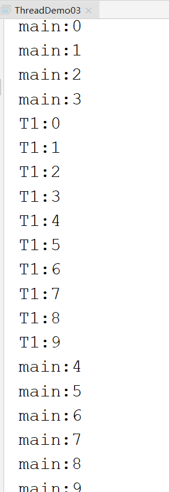


- 线程的礼让 :yield()，礼让仅仅是一种 尽可能事件，并不一定会100%执行

  ```java
  public class ThreadDemo03 implements Runnable {
  
      //Th1线程执行的方法
      @Override
      public void run() {
          for(int i=0;i<10;i++){
              System.out.println(   Thread.currentThread().getName()+":"+i  );
              if(i == 3){
                  Thread.yield();
                  System.out.println("礼让....");
              }
          }
      }
  
      //线程th1:执行“ T1:数字”
      //线程main：执行“ main:数字”
      public static void main(String[] args) throws InterruptedException {
          ThreadDemo03 t1 = new ThreadDemo03();
          Thread th1 = new Thread(t1,"T1") ;
          th1.start();
  
  
          ThreadDemo03 t2 = new ThreadDemo03();
          Thread th2 = new Thread(t2,"T2") ;
          th2.start();
      }
  }
  
  ```


## 示例

1.驾校练车： 某个驾校每天只能给30个学生练车，有20个普通学生，10个vip。开始时，普通和VIP并发叫号

- 叫到vip的概率比普通的高。

- vip的练车时间是普通学生的3倍；

- 要求vip学生必须在 普通学员之前全部结束。


## 数据安全问题

当多个线程并发访问同一个资源时（对象、方法、代码块），经常会出现一些“不安全”的线程。

举例：假设有100张火车票，同时被a、b两个站点售卖。

线程安全问题      线程不安全问题    


```java
import java.nio.channels.SeekableByteChannel;

public class TicketsDemo implements  Runnable {
    private int tickets = 10000 ;
    //买火车票
    @Override
    public void run() {
        while(true){
            //买火车票
            sell();
        }
    }

    public void sell(){
        if(tickets > 0){
            tickets -- ;
            System.out.println(Thread.currentThread().getName()+"-正在售卖,剩余票数：" + tickets );
        }
    }

    public static void main(String[] args) {
        TicketsDemo ticket = new TicketsDemo() ;//Rnnable

        Thread a = new Thread(ticket,"a");
        Thread b = new Thread(ticket,"b");


        a.start();
        b.start();
    }
}

```


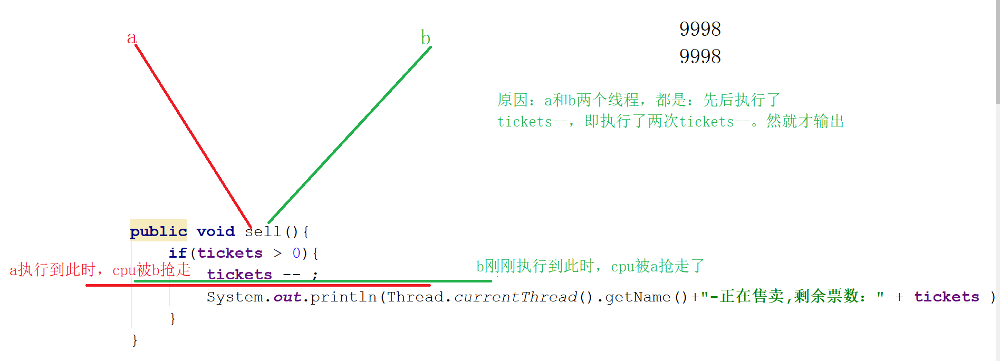


如何解决 线程安全问题？ 加锁：可以保证多个线程 串行执行，即不要 相互争夺着抢占资源

卫生间：a和b去卫生间。  如果a正在使用，则加一把锁，表示正在使用....

synchronized：给共享的资源加锁

加锁的形式：

- 给方法加锁

public  synchornized 返回值 方法名(){   ...  }

```java
    public  synchronized  void sell(){
        if(tickets > 0){
            tickets -- ;
            System.out.println(Thread.currentThread().getName()+"-正在售卖,剩余票数：" + tickets );
        }
    }
```

- 给代码块加锁

```java
    public  void sell(){
        synchronized (this) {//this：换成其他任意对象都可以（例如上卫生间时加的锁可以是一把真实的锁，也可以是一个提示牌...）
            if (tickets > 0) {
                tickets--;
                System.out.println(Thread.currentThread().getName() + "-正在售卖,剩余票数：" + tickets);
            }
        }
    }
```

解锁：解锁的时机是 以下任一个条件：

- 正常解锁：将sychronized修饰的方法、代码块执行完毕；
- 异常解锁：如果sychronized修饰的方法出现了异常，则会自动解锁

## 死锁

resource-a 和resource-b两个资源，以及A\B两个线程。

A：已经占有 resource-a，等待使用resource-b

B:已经占有 resource-b，等待使用resource-a

死锁会严重造成系统资源的损耗： A、B两个线程处于长期等待状态；resource-a\resource-b两个资源被死锁的线程 长期锁住，但又无法发挥作用

死锁

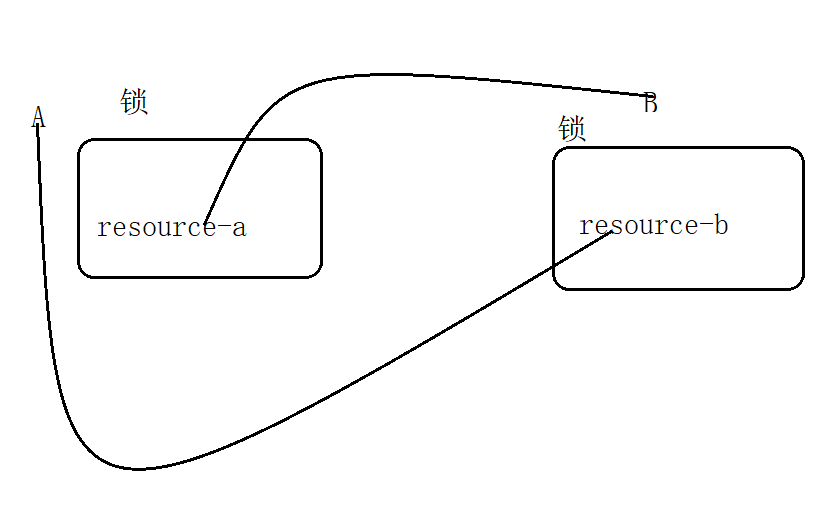

```java

//本题出现死锁的情况 是一种假设：如果符合预期（A给a加了锁，在等待b;B给b加了锁，在等待a），则会出现死锁；否则，不会。
class AThread implements  Runnable{
    @Override
    public void run() {
        synchronized (DeadLock.resource_a) {
            System.out.println("A线程：已经给resource-a加了锁");
            try {
                Thread.sleep((long)(Math.random()*3000) );
            } catch (InterruptedException e) {
                e.printStackTrace();
            }

            synchronized (DeadLock.resource_b){//尝试给B加锁
                System.out.println("A线程：等待给resource-b加锁...");
            }
        }
    }
}
class BThread implements  Runnable{
    @Override
    public void run() {
        synchronized (DeadLock.resource_b) {
            System.out.println("B线程：已经给resource-b加了锁");
            try {
                Thread.sleep((long)(Math.random()*3000) );
            } catch (InterruptedException e) {
                e.printStackTrace();
            }
            synchronized (DeadLock.resource_a){
                System.out.println("B线程：等待给resource-a加锁...");
            }
        }
    }
}


public class DeadLock {
    static String resource_a = "resource-a" ;
    static String resource_b = "resource-b" ;

    public static void main(String[] args) {
        Thread A = new Thread(new AThread());
        Thread B = new Thread(new BThread());

        A.start();
        B.start();
    }

}

```

死锁的解决：

产生死锁的根本原因：（操作系统知识）

- 系统资源不足

- 多线程的执行顺序不合理：算法问题，解决死锁 可以通过算法解决： 银行家算法； ”产生死锁有四个必要条件“，避免死锁 就可以打破四种必要条件。

  


|                              | 是否同步锁 | 效率 | 使用场景         |
| ---------------------------- | ---------- | ---- | ---------------- |
| 线程安全（不会出现并发问题） | 是         | 低   | 并发访问共享资源 |
| 非线程安全（出现并发问题）   | 否         | 高   | 吞吐量优先       |

哪个好？没有最好，只能说根据当前业务 哪个更加合适。


jdk中的线程安全/非线程安全的支持：

Hashtable：线程安全，效率低

HashMap：非线程安全，效率高


StringBuffer/StringBuilder：

StringBuffer：线程安全

StringBuilder: 非线程安全


ArrayList：1.非线程安全，可能会出现一些数据不安全的问题，甚至报错

​                    2.在设计之初 没有过多的考虑并发问题，因此有一些问题


示例：ArrayList在设计时 存在的问题

```java
package juc;

import java.util.ArrayList;
import java.util.Iterator;
import java.util.List;

public class ArrayListDemo {
    public static void main(String[] args) {
        List<String> list = new ArrayList<>();
        list.add("aaa") ;
        list.add("bb") ;
        list.add("cc") ;
        Iterator<String> iter = list.iterator();
        while(iter.hasNext()){
            System.out.println(iter.next());

            list.add("xxx");
        }
    }
}

```


以上代码，的iter.next()是java.util.ArrayList.Itr中的next()方法。

```java
        final void checkForComodification() {
            if (modCount != expectedModCount)
                throw new ConcurrentModificationException();
        }
```

modCoutn是迭代器实际的指向位置；expectedModCount是迭代器期望的指向位置；为了防止数据被篡改，arraylist会判断二者是否相等。

通过源码可知：ArrayList的add()会增加modCount 。正常流程：先add()，并且在add()时会 增加modCount，然后iter.next()来检查modCount\expectedModCount是否相等； 

本程序的错误流程：先add()，再iter.next() 、又add()、又iter.next() 

以上：if(modCount != expectedModCount)非常类似 版本控制技术，严格来讲 被称为  "fail-fast策略"。


解决：使用juc中相应对ArrayList的并发支持：CopyOnWriteArrayList


## JUC

java.util.concurrent：包名，从jdk.1.5之后提供，包含了很多 用于并发编程的工具类

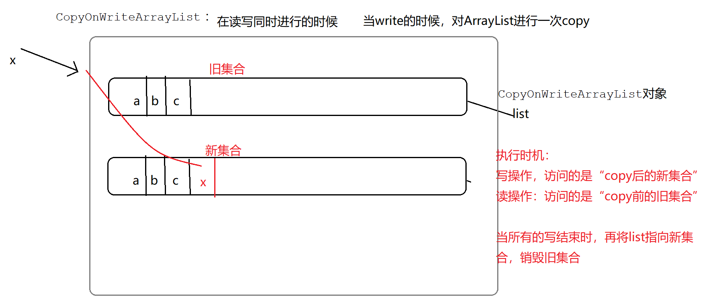

使用CopyOnWrite解决ArrayList并发问题。

```java
package juc;

import java.util.ArrayList;
import java.util.Iterator;
import java.util.List;
import java.util.concurrent.CopyOnWriteArrayList;

public class ArrayListDemo {
    public static void main(String[] args) {
        CopyOnWriteArrayList<String> list = new CopyOnWriteArrayList<>();
        list.add("aaa") ;
        list.add("bb") ;
        list.add("cc") ;
        Iterator<String> iter = list.iterator();
        while(iter.hasNext()){
            System.out.println(iter.next());
            list.add("xxx");
        }
        System.out.println("---");

        Iterator<String> iter2 = list.iterator();
        while(iter2.hasNext()){
            System.out.println(iter2.next());
        }
    }
}

```

并发容器：CopyOnWriteArrayList，CopyOnWrite*... ,ConcurrentHashMap,Concurrent* ,PriorityBlockingQueue。

## ConcurrentHashMap

提升HashMap的并发性能。

- JDK7

先看一下HashMap,   结构= 数组+链表

数组层面：HashMap的元素是一个 由key-value组成的元素（entry)。如果entry存放到hashmap中：会先根据此entry的key值计算出一个 hashcode，然后再将这个hashcode和数组的长度求余，计算出来的值 就是数组的下标。之后该entry元素 就会存入到该下标对应的 数组中元素中。例如，entry(key=s01,value=stu01)：先计算s01的hashcode(比如是123)，然后 123%数组长度(比如长度是10) ，结果是3。然后这个结果3就是数组元素的下标，最后将 该entry存放如 数组的第3个位置中。

链表层面：如果有多个entry最终的计算结果相同（key01=111,key02=221,则这两个entry的计算结果都是1），则这么多相同结果的entry用链表链接起来。

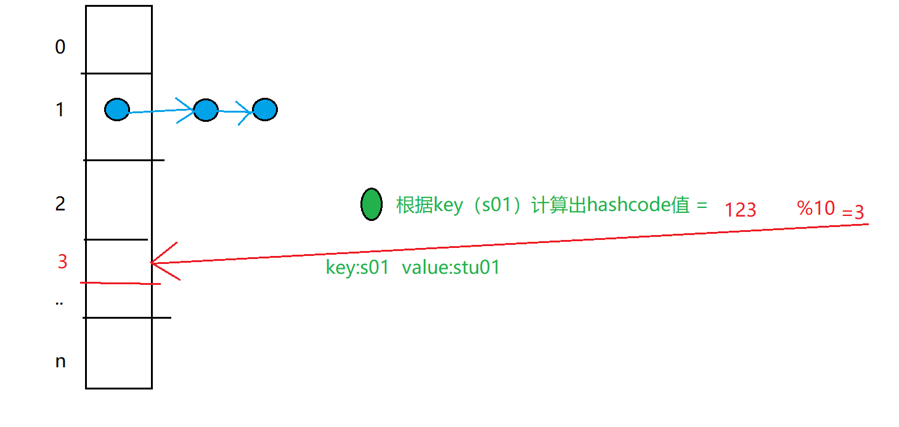

HashMap是非线程安全，可能存在并发问题。解决？ConcurrentHashMap可以用于解决并发问题

ConcurrentHashMap结构：

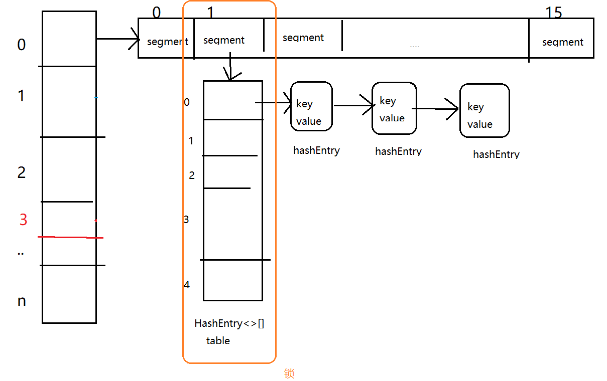

解决并发问题：给每一个segment加一把锁。可以现实：既可以用锁来避免并发访问时的冲突；又避免“给整个容器枷锁”导致性能降低的情况。


JDK8：

HashMap/ConcurrentHashMap结构类似：

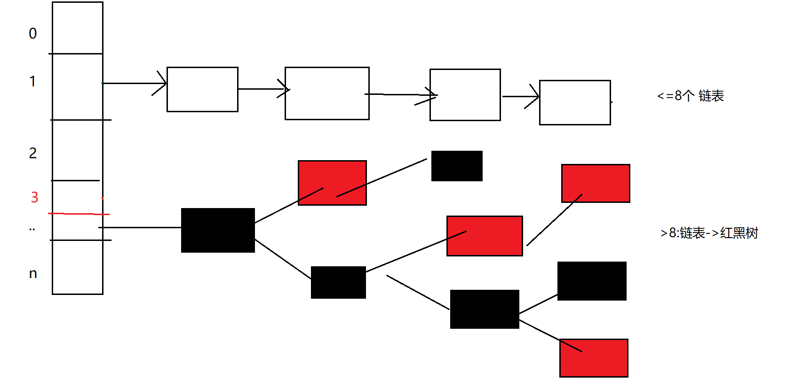


HashMap/ConcurrentHashMap区别：

HashMap并发问题

ConcurrentHashMap解决并发问题：大量使用了volatile（线程可见性）、synchronized（锁）、CAS无锁算法实现的。

> HashMap/ConcurrentHashMap二者都是一个AbstractMap的子类，是平级的，二者之间没有继承关系。


使用层面：不考虑并发，使用HashMap；如果在高并发环境，ConcurrentHashMap。

使用案例：

```java
package juc;

import java.util.concurrent.ConcurrentHashMap;

public class TestConcurrentHashMap {
    public static void main(String[] args) {
        ConcurrentHashMap<String,Object> chm =  new ConcurrentHashMap<>();
        chm.put("s01", new Object());
        chm.put("s02", new Object());
        chm.put("s03", new Object());
        chm.putIfAbsent("s03",new Object());//如果key不存在，则增加；否则不增加

        System.out.println(chm);
    }
}

```


## 读写锁


在一般的项目中，都是读多写少，并且只有“写”可能引起并发冲突。 就可以设置成 读写分离：读写锁。

juc中的读写锁

```java
public interface ReadWriteLock {
    /**
     * Returns the lock used for reading.
     *
     * @return the lock used for reading
     */
    Lock readLock();

    /**
     * Returns the lock used for writing.
     *
     * @return the lock used for writing
     */
    Lock writeLock();
}

```

- 读锁：readLock()。加了读锁的资源，可以在没有写锁的情况下 被多个线程共享。即：如果t1线程已经加了读写，那么此时：

  - 如果t2要申请写锁，则t2会一直等待t1解锁
  - 如果t2要申请读写，则t2会直接加读锁。也就是说，t1和t2可以共同加读锁。

     小结：如果一个线程a加了读写，另一些线程只有在 申请加写锁时，才需要等待线程a解锁。

- 写锁：writeLock()，独占锁。如果一个线程a加了写锁，则其他线程必须等待a释放锁。


## 线程通信

多个线程在争夺同一个资源时，为了保证协同工作，可以进行线程通信。

通信主要依赖于3个方法:

- wait（）【自己】：使当前线程处理等待状态（阻塞），一直的线程调用此对象的notify()或notifyAll()方法
- notify()【别人】：唤醒一个正在等待线程；如果有多个线程正在等待，则随机唤醒一个。
- notifyAll()【别人】：唤醒全部正在等待的线程

注意：

1.线程在等待时，会被一个监听器所监听。因此，当其他线程调用notify()、notifyAll（）时，实际是通过监听器来唤醒线程。

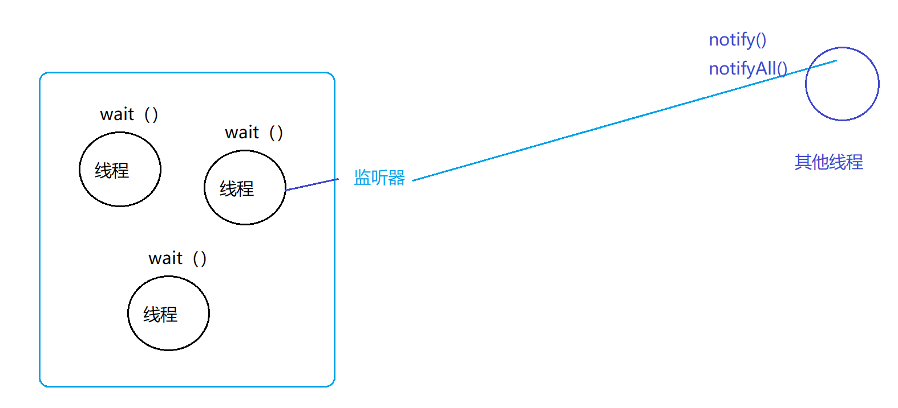

2.这三个线程通信的方法，谁定义的？是Object定义native方法。因为锁是 对象级，不是线程级的。

```java
synchronized{
    ...
}

```

因为任何对象都可以使用synchronized加锁，而线程通信又依赖于加锁，因此线程通信属于“任何对象”的使用范围，即对象级，所以是在Object中定义的。

3.这三个方法，必须定义在synchronized中定义，否则报异常。

4.建议：jdk建议：为了避免一些并发问题，建议将wait()方法写在循环中，如下：

```java
     * As in the one argument version, interrupts and spurious wakeups are
     * possible, and this method should always be used in a loop:
     * <pre>
     *     synchronized (obj) {
     *         while (&lt;condition does not hold&gt;)
     *             obj.wait();
     *         ... // Perform action appropriate to condition
     *     }
     * </pre>
```


## 生产者消费者案例

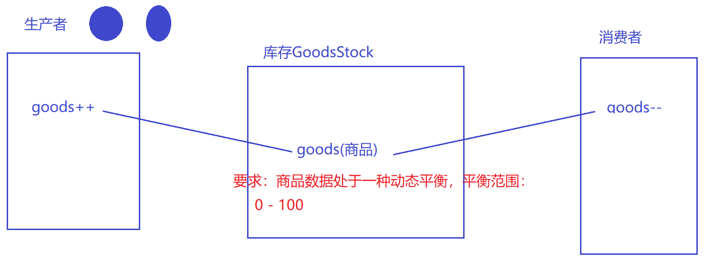

库存

```java
package producerandconsumer;
//库存
public class GoodsStock {

    int goodsNum  ;

    //新增
    public synchronized void produceGoods(){
        try {
            if (goodsNum < 100) {
                goodsNum++;
                //唤醒消费者
                notifyAll();
                Thread.sleep((long) (Math.random() * 10));
                System.out.println("生产商品，商品目前的数量：" + goodsNum);
            } else {
                wait();//如果超过100，则停止生产
            }

        }catch (InterruptedException e){
            e.printStackTrace();
        }


    }

    //减少
    public synchronized void consumeGoods(){
    try {
        if (goodsNum > 0) {
            goodsNum--;
            //唤醒产生者
            notifyAll();

            Thread.sleep((long) (Math.random() * 10));
            System.out.println("消费商品，商品目前的数量：" + goodsNum);
        }else{
            wait();//如果没有商品，则暂停消费。
        }


    }catch (InterruptedException e){
        e.printStackTrace();
    }

    }
}

```

生产者：

```java
package producerandconsumer;

public class GoodsProducer implements Runnable {
    GoodsStock goodsStock ;

    public GoodsProducer(){

    }
    public GoodsProducer(GoodsStock goodsStock){
        this.goodsStock = goodsStock ;
    }
    @Override
    public void run() {
        //生产商品
        while(true){
            goodsStock.produceGoods();
        }
    }


}

```

消费者

```java
package producerandconsumer;

public class GoodsConsumer implements Runnable {
    GoodsStock goodsStock ;


    public GoodsConsumer(GoodsStock goodsStock){
        this.goodsStock = goodsStock ;
    }

    @Override
    public void run() {
        while(true){
            goodsStock.consumeGoods();
        }
    }
}

```

测试

```java
package producerandconsumer;

public class Test {
    public static void main(String[] args) {
        GoodsStock goodsStock = new GoodsStock() ;//商品库存

//        GoodsProducer p1 = new GoodsProducer() ;
//        GoodsProducer p2 = new GoodsProducer() ;
        //注意多个生产者线程 共享同一份库存
        GoodsProducer p = new GoodsProducer(goodsStock) ;

        Thread tp1 = new Thread(p) ;
        Thread tp2 = new Thread(p) ;

//        GoodsConsumer c1 = new GoodsConsumer() ;
//        GoodsConsumer c2 = new GoodsConsumer() ;
        GoodsConsumer c = new GoodsConsumer(goodsStock) ;
        Thread tc1 = new Thread(c) ;
        Thread tc2 = new Thread(c) ;


        tp1.start();
        tp2.start();

        tc1.start();
        tc2.start();
    }
}

```

运行结果

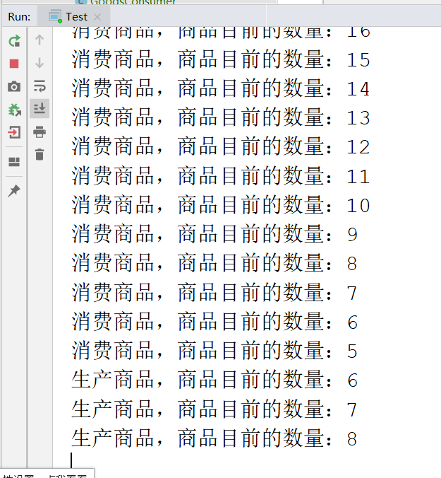


## 改造生产者消费者

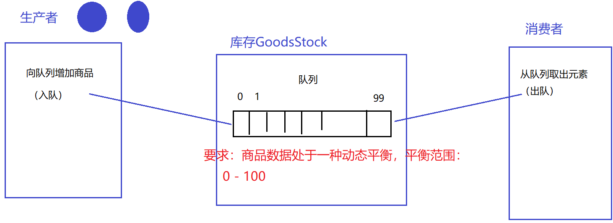

队列、线程池

商品

```java
package producerandconsumer2;
//商品
public class Goods {
    private int id ;
    private String name ;

    public Goods() {
    }
    public Goods(int id, String name) {
        this.id = id;
        this.name = name;
    }

    public int getId() {
        return id;
    }

    public void setId(int id) {
        this.id = id;
    }

    public String getName() {
        return name;
    }

    public void setName(String name) {
        this.name = name;
    }
}

```

带队列的库存：

```java
package producerandconsumer2;

import sun.security.provider.NativePRNG;

import java.util.concurrent.BlockingQueue;
import java.util.concurrent.TimeUnit;

//库存
public class GoodsStock {


//    Goods[] goods = new Goods[100]
    //队列：生产者和消费者 共享的队列
    private BlockingQueue<Goods> queue ;
    private static int count ;//记录一共生产了多少量商品

    public GoodsStock(BlockingQueue<Goods> queue) {
        this.queue = queue;
    }

    public GoodsStock() {
    }
    //新增
    public synchronized void produceGoods(){
        try {
            Goods goods = new Goods();
            boolean flag = queue.offer(goods, 3, TimeUnit.SECONDS);
            if(flag){
                count++ ;
                goods.setId(count);
                goods.setName("goods"+count);

                System.out.println("生产成功：商品编号："+goods.getId()+",名字："+goods.getName()  );
                Thread.sleep((long)(Math.random()*10));

                notifyAll();//有新商品了，通知消费者消费...

            }else{
                System.out.println("生产商品失败...");
            }

            if(queue.size() >= 100){
                System.out.println("库存已满，等待消费。。。");
                wait();
            }


        }catch(Exception e){
            e.printStackTrace();
        }

    }

    //减少
    public synchronized void consumeGoods(){
        try {
            Goods goods = queue.poll(3, TimeUnit.SECONDS);
            if(goods != null){
                System.out.println("消费goods，编号："+goods.getId()+ ",名称："+goods.getName());
                Thread.sleep( (long)(Math.random()*10) );
                notifyAll();
            }else{
                System.out.println("消费失败。。。");
            }
            if(queue.size()>0){

            }else{
                System.out.println("库存为空，等待生产。。。");
                wait();
            }


        }catch (Exception e){
            e.printStackTrace();
        }

    }
}

```

生产者

```java
package producerandconsumer2;

public class GoodsProducer implements Runnable {

    GoodsStock stock ;


    public GoodsProducer(){

    }

    public GoodsProducer(GoodsStock stock){
        this.stock = stock ;
    }


    @Override
    public void run() {
        //生产商品
        while(true){
            stock.produceGoods();//生产
        }
    }


}

```

消费者

```java
package producerandconsumer2;

public class GoodsConsumer implements Runnable {
    GoodsStock goodsStock ;

    public GoodsConsumer(){
    }
    public GoodsConsumer(GoodsStock goodsStock){
        this.goodsStock = goodsStock ;
    }

    @Override
    public void run() {
        while(true){
            goodsStock.consumeGoods();
        }
    }
}

```

测试

```java
package producerandconsumer2;

import java.util.concurrent.BlockingQueue;
import java.util.concurrent.ExecutorService;
import java.util.concurrent.Executors;
import java.util.concurrent.LinkedBlockingQueue;

public class Test {
    public static void main(String[] args) throws InterruptedException {
        BlockingQueue<Goods> queue = new LinkedBlockingQueue<>(100);

        GoodsStock goodsStock = new GoodsStock(queue) ;//商品库存

        GoodsProducer produce1 = new GoodsProducer(goodsStock) ;
        GoodsProducer produce2 = new GoodsProducer(goodsStock) ;

        GoodsConsumer consumer1 = new GoodsConsumer(goodsStock) ;
        GoodsConsumer consumer2 = new GoodsConsumer(goodsStock) ;

        //将生产者和消费者加入线程池
        ExecutorService executorService = Executors.newCachedThreadPool();
        executorService.execute(produce1);
        executorService.execute(produce2);
        executorService.execute(consumer1);
        executorService.execute(consumer2);
        Thread.sleep(20000);
        executorService.shutdown();

    }
}

```


## Lock

```
synchronized + wait()/notify()/notifyAll()
```

另一种形式（更加强大）：

synchronized   -    Lock( lock(), unlock() )

wait():                -    Condition中的await()方法

notify()/notifyAll():Condition中的signal()/signalAll()方法

修改后Lock方式修改以上代码

```java
package producerandconsumer3;

import java.util.concurrent.BlockingQueue;
import java.util.concurrent.TimeUnit;
import java.util.concurrent.locks.Condition;
import java.util.concurrent.locks.Lock;
import java.util.concurrent.locks.ReentrantLock;

//库存
public class GoodsStock {


//    Goods[] goods = new Goods[100]
    //队列：生产者和消费者 共享的队列
    private BlockingQueue<Goods> queue ;
    private static int count ;//记录一共生产了多少量商品

    private Lock lock = new ReentrantLock() ;
    private Condition condition =  lock.newCondition();

    public GoodsStock(BlockingQueue<Goods> queue) {
        this.queue = queue;
    }


    public GoodsStock() {
    }
    //新增
    public  void produceGoods(){
        lock.lock();
        try {
            Goods goods = new Goods();
            boolean flag = queue.offer(goods, 3, TimeUnit.SECONDS);
            if(flag){
                count++ ;
                goods.setId(count);
                goods.setName("goods"+count);

                System.out.println("生产成功：商品编号："+goods.getId()+",名字："+goods.getName() +",库存："+ queue.size() );
                Thread.sleep((long)(Math.random()*10));

//                notifyAll();//有新商品了，通知消费者消费...
                condition.signalAll();

            }else{
                System.out.println("生产商品失败...");
            }

            if(queue.size() >= 100){
                System.out.println("库存已满，等待消费。。。");
//                wait();
                condition.await();
            }


        }catch(Exception e){
            e.printStackTrace();
        }finally {
            lock.unlock();
        }

    }

    //减少
    public  void consumeGoods(){
        lock.lock();
        try {
            Goods goods = queue.poll(3, TimeUnit.SECONDS);
            if(goods != null){
                System.out.println("消费goods，编号："+goods.getId()+ ",名称："+goods.getName() +",库存："+ queue.size());
                Thread.sleep( (long)(Math.random()*10) );
//                notifyAll();
                condition.signalAll();
            }else{
                System.out.println("消费失败。。。");
            }
            if(queue.size()>0){

            }else{
                System.out.println("库存为空，等待生产。。。");
//                wait();
                condition.await();
            }


        }catch (Exception e){
            e.printStackTrace();
        }finally {
            lock.unlock();
        }

    }
}

```

|      | synchronized                    | Lock                               |
| ---- | ------------------------------- | ---------------------------------- |
| 形式 | 关键字                          | 接口                               |
| 加锁 | {                               | lock()，多种方式（尝试一段时间等） |
| 解锁 | }，即方法正常结束;  或 出现异常 | unlock()                           |
| 状态 | 无法判断                        | 可以判断                           |
| 中断 | 不支持                          | 支持                               |

建议：建议使用Lock，更加强大

尝试加锁的代码

```java
package juc;

import java.util.concurrent.TimeUnit;
import java.util.concurrent.locks.Lock;
import java.util.concurrent.locks.ReentrantLock;

public class TryLockDemo extends  Thread {
  private static Lock lock =   new ReentrantLock();

    @Override
    public void run() {
        String threadName = Thread.currentThread().getName();
        boolean flag = false ;
        try {
           flag = lock.tryLock(5, TimeUnit.MICROSECONDS);
            System.out.println("尝试加锁结果："+flag);
            if(flag){
                System.out.println(threadName+"加锁成功...");
                Thread.sleep(20);
            }else{
                System.out.println(threadName+"加锁失败。。。");
            }

        }catch (Exception e){
            e.printStackTrace();
        }finally {
            if(flag) {
                System.out.println(threadName + "解锁...");
                lock.unlock();
            }
        }

    }

    public static void main(String[] args) {
        TryLockDemo t1 = new TryLockDemo();
        TryLockDemo t2 = new TryLockDemo();
        t1.setName("t1");
        t2.setName("t2");
        t1.start();
        t2.start();

    }
}

```

## 中断等待：如果线程t要访问某个一资源，但此资源已经被其他线程长期加了锁，则线程t可以被其他线程结束等待状态

```
lock.lockInterruptibly();//加了一把可被中断的锁

如何中断？ 调用一个interrupt();


如果线程被中断 会抛出一个异常InterruptedException
```

```java
package juc;

import java.util.concurrent.locks.Lock;
import java.util.concurrent.locks.ReentrantLock;

class MyThread extends  Thread{
    WaitInterrupt waitInterrupt ;
    public MyThread(WaitInterrupt waitInterrupt){
        this.waitInterrupt = waitInterrupt ;
    }


    @Override
    public void run() {
        try {
            waitInterrupt.myLock(Thread.currentThread());//当前线程休眠3秒
        }catch (Exception e){
            System.out.println(Thread.currentThread().getName()+"被中断");
        }
    }
}

public class WaitInterrupt {
    private Lock lock = new ReentrantLock() ;

    public static void main(String[] args) throws  Exception {

        WaitInterrupt inter = new WaitInterrupt();
        MyThread t1 = new MyThread(inter);
        t1.setName("t1");
        MyThread t2 = new MyThread(inter);
        t2.setName("t2");

        t1.start();//休眠3秒
        t2.start();//休眠3秒

        Thread.sleep(1000);//main线程休眠1秒
        t2.interrupt();//中断t2
    }


    public void myLock(Thread thread   )throws InterruptedException {
        try {

            lock.lockInterruptibly();//加了一把可被中断的锁

            System.out.println( thread.getName() + "加锁");
            Thread.sleep(3000);
        }
        finally
        {
            lock.unlock();
            System.out.println( thread.getName() + "解锁");
        }
    }

}

```


## 无锁算法CAS

为了保证并发环境下的 数据安全，可以使用锁，也可以使用 一种无锁算法CAS算法。

加锁：缺点，消耗系统资源比较大（切换上下文对象，造成CPU调度很频繁）。如图，将cpu从t1切换到t2是一种比较消耗CPU资源的操作

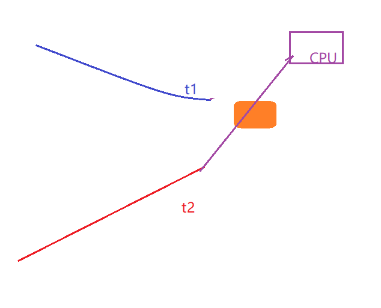


加锁：是一种悲观策略，线程在访问资源时  总认为会和其他资源造成冲突，因此需要加锁。

CAS：是一种乐观策略，线程在访问资源时  总认为不会和其他资源造成冲突，因此有两种可能：

- 假设成功（的确没有和其他线程产生冲突）

  OK

- 假设失败（实际和其他线程产生了冲突）

  再试：重新获取最新的资源，然后再次访问（如果发现要访问的资源不是最新的，则一直尝试；直到拿到最新数据为止）

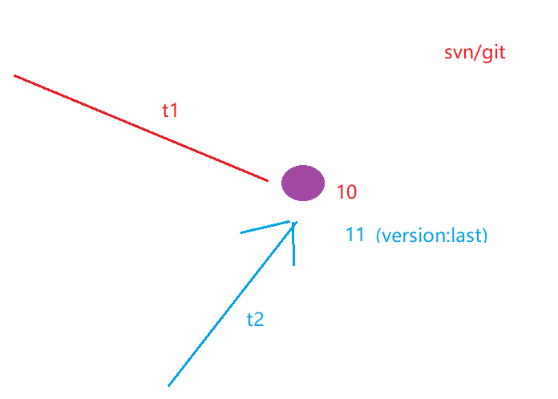


## 线程通信：信号量Semaphor

Semaphor编程：默认所有的线程都是阻塞；有个一许可acquire()，只有获取了许可的线程 ，才能运行。并且许可的数量，可以通过persmits属性设置。release()释放许可

以下示例：有10个线程尝试执行，但只有3个许可证。

```java
package juc;

import java.util.concurrent.ExecutorService;
import java.util.concurrent.Executors;
import java.util.concurrent.Semaphore;

public class SemaphoreDemo {
    public static void main(String[] args) {

        ExecutorService executor = Executors.newCachedThreadPool();
        Semaphore sem = new Semaphore(3) ;//同一时间 最多有3个线程可以并发运行
        //假设有10个线程
        for( int i=0;i<10;i++){
            final int tId = i ;
            executor.execute(
                         () ->{
                             try{
                                  sem.acquire();//获取许可（同一时间 只有3个许可）
                                 System.out.println("线程" + tId +"获取到了许可，正在执行");
                                Thread.sleep((long)(5000*Math.random()));
                                sem.release();//释放许可
                             }catch (InterruptedException e){

                             }catch(Exception e){
                                 e.printStackTrace();
                             }
                         }
            );//给线程中 加入一个新线程
        }
//            executor.shutdown();
    }
}

```


